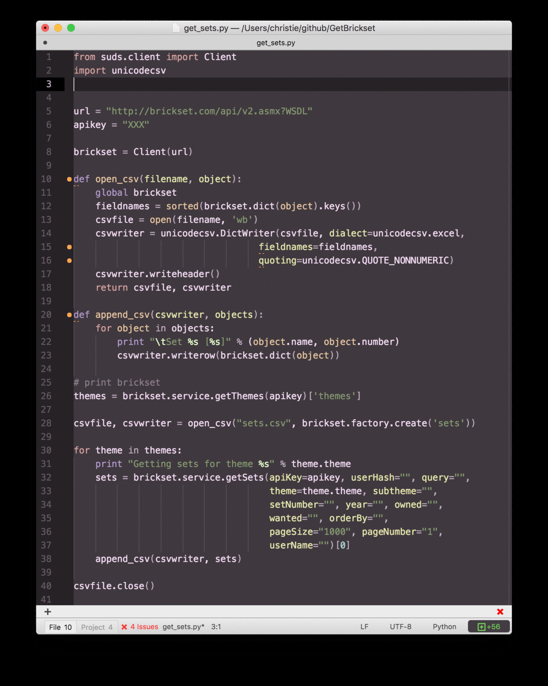
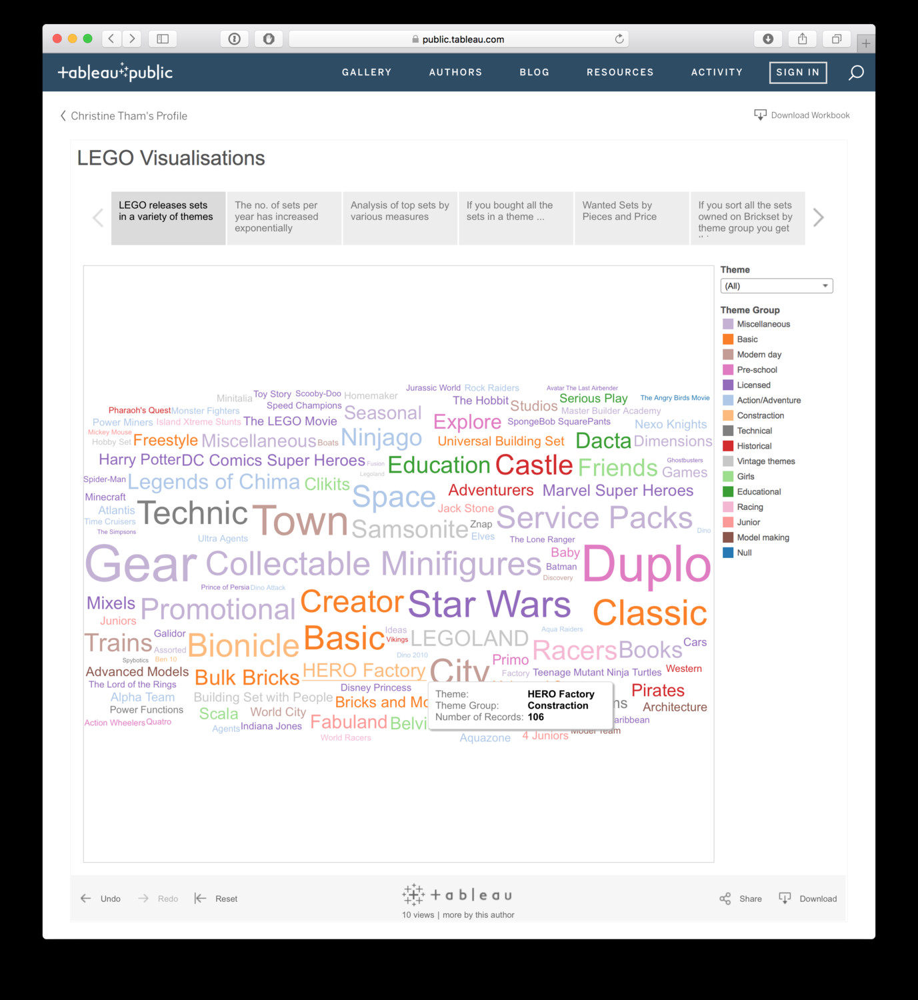

I am a lover of [LEGO](http://www.lego.com/en-us/default.aspx) (I think the official term for people like me is “Adult Fan Of LEGO”) and not ashamed to admit i have bought way too many LEGO sets and likely to buy more.

Lately I have also been using [Python](https://www.python.org/) to do various data ingestion and wrangling tasks (along with [R](https://www.r-project.org/)). I recently learnt both languages by signing up to a few courses on [Coursera](https://www.coursera.org/).

And of course I have been using [Tableau](http://www.tableau.com/) for a while now.

Recently I discovered the popular LEGO fan website [Brickset.com](http://brickset.com/) has quite an extensive database of LEGO sets. It even has a [Web Services API](http://brickset.com/tools/webservices) to enable the database to be queried.

So I decided why not combine my love for LEGO, Python and Tableau by extracting data from Brickset using Python, and then doing some visualisations on Tableau Public?

I wrote the following code to extract a list of sets from the database (I have masked my apiKey – to run the code, you will need to request your own apiKey from Brickset):

The visualisations have been posted to Tableau Public. You can enjoy them by clicking on this link:

[Link to LEGO Visualisations on Tableau Public](https://public.tableau.com/views/LEGO/LEGOVisualisations?:embed=y&:display_count=yes&:showTabs=y)

