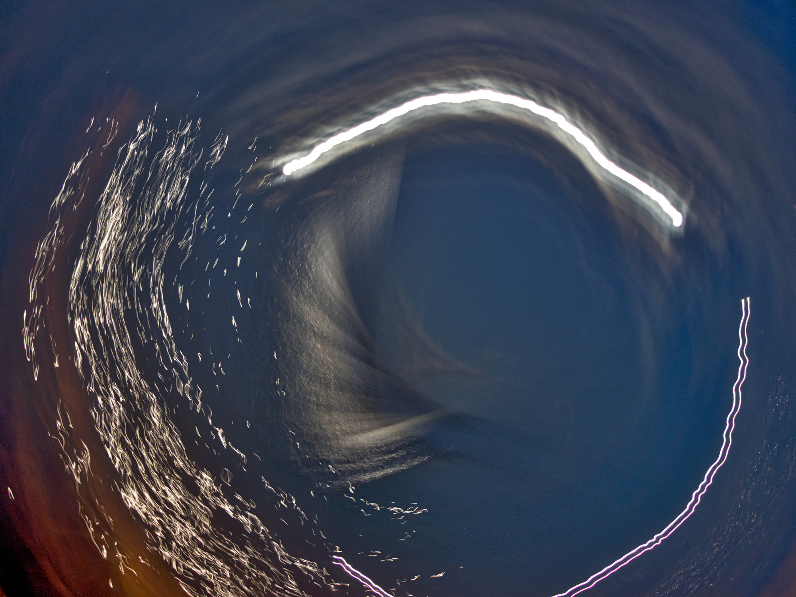
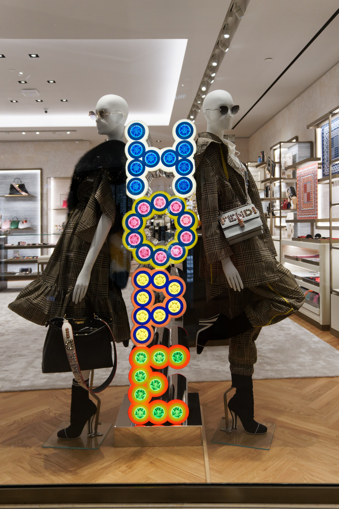

Last year, I wrote an article making what I thought (at the time) were controversial predictions for 2017: [Five Tech Predictions for 2017](/blog/2016-12-31-five-tech-predictions-for-2017/).

I wrote it as a bit of fun, I wasn’t even sure anyone was going to read it, but it ended up being liked by a few people, and the other day someone reminded me that they were looking forward to my predictions for 2018.

But before I start, how did I fare with the 2017 predictions? As a reminder, here they are again:

1. Goodbye Uber
2. The end of Android
3. Microsoft Linux
4. AI will not happen (yet)
5. The startup bubble bursts

Of the above, the first prediction (Goodbye Uber) was the one I thought was least likely to happen, which is why I put it up first. I predicted that “Uber will soon find that they have to radically overhaul their business model, and they may even fail entirely.”

At that time, I was basing my prediction simply on the basis that Uber were burning over US$2b in cash subsidising rides in trying to capture new markets and I did not think this was sustainable, nor did I think Uber will be successful in their world domination success-at-all-costs strategy.

Well, I was right, but not quite in the way I predicted. Yes, Uber are still burning a lot of cash at an even faster rate (Uber had a nett loss of nearly US$1.5b in Q3 2017 alone, and currently have enough cash for one more year at this rate), and have some notable failures in various markets, including Russia and China (where Uber merged with local competitors) as well as bans from various cities (notably London).

But what was surprising was everything else that made 2017 an _annus horribilis_ for Uber: Susan Fowler, leadership losses, Travis Kalanick, Waymo and Levandowski, customer/driver personal data hacked, and many more bizarre events.

Uber’s valuation has now been slashed by the recent Softbank investment, and it is clear going forward Uber’s business model will be very different with the new CEO, a new leadership team, and an upgraded board. Will Uber fail? I am now inclined to think they won’t, provided they can “ride through” (pun intended) the current set of crises.

How did I do on the other predictions? Here is a quick assessment:

- **The end of Android**: No, Android hasn’t quite disappeared or replaced (Google’s Fuchsia project has made some significant advances but still not ready for primetime). However, the platform and ecosystem remains in a precarious position and the future is still unclear. The European Commission still haven’t released the results of their [antitrust investigation into Android](http://europa.eu/rapid/press-release_MEMO-15-4782_en.htm), but the outcome is not likely to be a pleasant one. Android manufacturers barely make any profits (apart from Samsung, however, they have other issues to contend with), the ecosystem remain fractured and malware-prone, and Google’s efforts at becoming a hardware manufacturer are still questionable (the Pixel devices have many well publicised hardware issues and have negligible market share, and it seems Google have now abandoned the tablet market). Android’s forays into new form factors (wearables, TVs) have not been successful. I think Google will need to pivot soon (see my prediction for 2018).
- **Microsoft Linux**: No, we did not see a Microsoft Linux distribution, however, Microsoft introduced something better: Azure Shell, basically turning the cloud into a gigantic Unix-like computer accessible through a nice, friendly shell prompt. This is really taking “The Network is the Computer” into a new level.
- **AI will not happen (yet)**: It seems everyone is doing “AI” and “AI” is everywhere, but not the “AI” I was referring to in my prediction, which is about achieving “computing consciousness, ie. a sentient machine.” But it turns out I have misunderstood AI: it’s not artificial, and it’s not intelligent. No one is really seriously pursuing the goal of machine consciousness (except perhaps Ford and Arnold in the TV series “Westworld”). Instead, the focus of “AI” is more about the exploitation of machine learning models for monetisation and commercial gain, as well as automation.
- **The startup bubble bursts**: Well, the bubble has somewhat deflated, but it didn’t burst. We have had some notable failures (like Juicero, Pebble etc.) but Fitbit and GoPro (the two companies I mentioned in my prediction) have recovered somewhat, however the jury is still out on those two. The climate and hype around tech startups are shifting, and there has been a bit of a backlash on tech startups, particularly in the US. More importantly, there is now another bubble that is threatening to consume all: cryptocurrencies (I will have more to say about this in 2018’s predictions).

So, all in all, whilst I wouldn’t say it was a perfect score (and to be honest, I never really thought they would all come true in exactly the way I predicted), my “controversial” predictions turned out not to be that outlandish after all.

So, without further ado, here are the predictions for 2018. As before, all photos are by me, but this time I regret to say many pixels have been sacrificed to bring you these photos, which are probably not the photos you are looking for.

## **1. Google pivoting**

Okay, this is not much of a prediction, more like stating the bleedin’ obvious. Google have a world domination strategy that is very similar to Microsoft in the 1990s, and unfortunately are copying Microsoft’s playbook so closely they are making the same mistakes, and risk facing the same issues Microsoft encountered.

Google want to be everything to everyone: they want to be your hardware provider, they want to surround yourself with all kinds of “services” and content, they want to own you and your personal data. They are always listening and always there and soon they will know more about yourself than you do.

Google used to see Apple as their main competitor in the tech space, they no longer do. Amazon is the new enemy. Google want to be in the retail space, and Google want to be the Overlords of your home. Google’s desire to become a hardware manufacturer is less about making the next iPhone killer (not that Google have been particularly successful to date), but really about the next generation of devices: home automation, virtual/augmented reality, autonomous vehicles.

In the ad space, Google continue to battle it out with Facebook, but concede they have lost the social media war. They want to win the next wars. We haven’t seen Google truly enter the entertainment space yet, but I predict they will in a big way. Youtube is just the start.

If any of this seems familiar, Microsoft tried doing all this in the 1990s – they wanted to own all device form factors, they wanted to be in entertainment and media, they were going to manage your personal identity and be everything to you.

## 2. Apple stumble

I wasn’t quite ready to call this out in 2017, and in hindsight I am glad I didn’t. But I think Apple will encounter a difficult period soon. There is no denying Apple have had a great run in the last decade, fuelled primarily by the iPhone but augmented by many other success stories (iPads, to a lesser extent macOS) but also slightly less-successful but still notable areas (the Apple Watch has been both more successful than the industry expected, but at the same time not quite as successful as Apple may have hoped).

But Apple aren’t successful at everything. Their services strategy is still unclear, and Apple have made some “minor” mistakes.

Apple face strong headwinds: appeasing the Dragon (China) but at the same time trying to be the privacy and liberty champion may turn out to be problematic, Apple are running out of headroom as a premium device manufacturer, and there are other dangers lurking in the horizon.

We haven’t reached the point of Peak Apple yet, but that day will come. Apple’s premium strategy is a very lucrative one (Apple make nearly all the profits from the smartphone market) but it increasingly paints Apple as a boutique or luxury label – Apple may yet evolve to be like a Leica or a Hermes, selling very good products at very expensive prices to a small but loyal market. Apple of course think they are more like Tiffanys – selling pretty little jewels at multiple price points. Time will tell.

## 3. Dumb human

Don’t worry about machine intelligence, worry more about what we are becoming. 2017 has proven just how easily we can be manipulated through social media, and how narcissistic and psychopathic we have become. On the “plus” side, soon we will be replaced by automation and our lives will be owned and ruled by major corporations acting as Big Brother.

The real issue with AI is not that it is evil and will suddenly become Skynet and start shooting at everyone. The real issue is that we are so willing to place our trust and confidence in the inference of a machine learning model. We are willing to believe in fake news that are increasingly engineered to confirm our biases, we watch content on streaming services that are increasingly programmed to appeal to the lowest common denominator, we are absorbed in taking selfies and pictures of what we eat and following “influencers”, we are increasingly willing to let ourselves be programmed by platforms that feed the pleasure centres of our brains.

I predict there will be some unfortunate consequences, not all will happen in 2018 but eventually. Innocent bystanders will be killed by autonomous vehicles. Misplaced reliance in AI models will cause a stock market crash (again), or start a war. It’s not going to be Armageddon (at least, I hope not) because I do believe we will learn and there will be a new balance.

## 4. The cryptocurrency bubble bursts

Again, this is not really a prediction, merely stating the inevitable. But it will be a very “fun” ride.

## 5. The post-technology world

All the above may seem like doom and gloom, and I may seem anti-technology, but really it is all about finding a new equilibrium. Some of us remember a world pre-computers, pre-Internet, pre-mobile phones, pre-social media, pre-streaming, pre-Cloud, pre-digital.

There has been a bit of a backlash against the tech industry, and some are rushing to embrace analog, still others are disconnecting themselves. These are reactions. In the end, I think our notion of who we are, what we are, what we care about, what we strive for, even our fundamental values and sense of self, will evolve and will change. Despite the somewhat negative nature of my predictions, I always hope for the best and will continue to enjoy the journey, as always.
