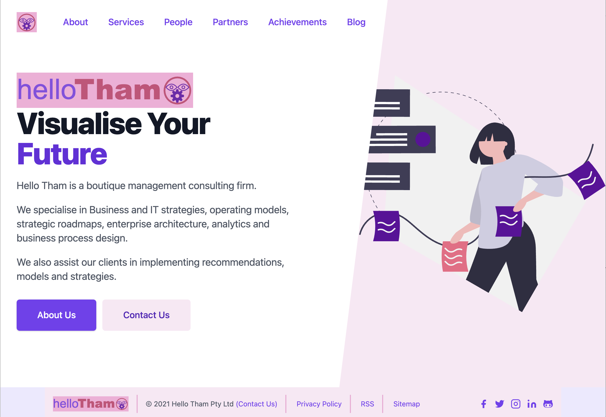

## About Hello Tham

[Hello Tham](https://hellotham.com) is a boutique management consulting firm.

We specialise in Business and IT strategies, operating models, strategic roadmaps, enterprise architecture, analytics and business process design.

We also assist our clients in implementing recommendations, models and strategies.

## Background on the Hello Tham corporate website

Ever since our company was established (in 2016), our web site has been built using the industry leading content management system
[WordPress](https://wordpress.org), currently used in over 60 million websites around the world
(according to [Wikipedia](https://en.wikipedia.org/wiki/WordPress)).

Why did we choose to change and rewrite our site completely? Is there something wrong with WordPress?

No, WordPress is still great, easy to use, has tons of beautiful themes and powerful plugins, and you can literally do anything you want in WordPress to produce excellent functional and usable websites. We still use WordPress to create websites for some of our clients.

However, there has been a revolution in web app development, architecture and deployment in the last few years, and we believe now is the perfect time to switch to the new and better way of the future.

Our new web site is rewritten from the ground up as a modern, serverless, web app - deployed globally.

What does this mean exactly? Traditional web sites require a backend server and is relatively difficult to deploy and scale to achieve the near 100% availability that anyone would expect of any website today. Even on the cloud, deploying a scalable, performant, highly available website can be challenging. As an example, the following diagram illustrates AWS recommendations for deploying and hosting a WordPress website:

Many companies and web agencies choose to use a managed WordPress hosting provider that takes care of the complex deployment architecture for you, and ensure your site remains up, secure, fast and updated.

However, your website will still be slow and inaccessible if your website is hosted in, say, Sydney Australia, and someone is accessing it from Africa, Asia, South America or perhaps parts of Europe and conceivably even in USA on a bad day in a remote location.

To solve that problem, good web hosting platforms/providers typically speed up your website by putting a **content delivery network**, or **content distribution network**(**CDN**), in front of your website. In the AWS reference architecture above, [Amazon CloudFront](https://aws.amazon.com/cloudfront/) is a CDN service offered by AWS.

A CDN takes static, pre-rendered versions of your web pages, and deploys them globally to many locations around the world, so that when someone accesses your website, they are accessing a local copy of your content at the location nearest to them, no matter where they are in the world. This works great, but does mean that all those locations need to be refreshed every time you make a change or release new content to your website.

## Migration to Jamstack and Gatsby

However, in the last few years, an alternate website deployment architecture has emerged. Variously referred to as serverless, static web apps, or [JAMstack](https://jamstack.org), the concept is fairly simple. If the ideal scenario for serving content for a website is via a CDN, which not just deploy a set of static web files directly to the CDN, and no backend server is required!

The benefits are immediate and fairly obvious:

- **_there is no server_**, nothing to manage, configure, patch, upgrade, or monitor
- web hosting costs are dramatically lower, and quite likely **_zero cost_**, as you are only paying for a CDN service (which many providers including AWS offer for free up to a generous limit)
- no server means the **_security of your website is guaranteed_**, there is nothing for a hacker to access or login to (the worst that can happen is someone compromises the CDN service and corrupts your files, in which case you can just redeploy in minutes to overwrite the content)
- the web site content is always **_up to date and refreshed,_** you never have to worry about the slight possibility that someone is accessing an older copy of your website because the CDN wasn't refreshed correctly (this happens more often than people like to admit, depending on how you have configured your website)
- your website is **_global and always fast_** as it is a set of static web files that is served from a CDN, from potentially hundreds (or even thousands) of locations around the world (depending on your CDN provider)
- you **_don't need to worry about SEO_** (search engine optimisation) (search engines generally like static fast content and tend to rank them high)

V1 of the new website used [NetlifyCMS](https://netlifycms.org) as a Git-based headless CMS. We also used the
[Gatsby + Netlify CMS Starter](https://github.com/netlify-templates/gatsby-starter-netlify-cms) created by Netlify as a starting point.

Much has changed since then. Gatsby has evolved to be much more than a static site generator. According to them:

> Gatsby enables developers to build fast, secure, and powerful websites using a React-based framework and innovative data layer that makes integrating different content, APIs, and services into one web experience incredibly simple.

## Current web site

The current website has been completely rewritten using the latest features in Gatsby, including functions support, improved image optimisation and MDX.
We also used [TailwindCSS](https://tailwindcss.com) and related assets in the ecosystem (TailwindUI, HeroIcons, Hero Patterns, HeadlessUI).

Features of the new website include:

- Full-featured blog with frontmatter (title, description, author, date, image, tags)
- Tags index page and individual tag pages
- Pagination in posts and tag pages
- Support for RSS feed, sitemap and robots.txt
- Automatic optimization of images in Markdown/MDX posts
- SVG design (unDraw, Hero Patterns, HeroIcons)
- Support for code syntax highlighting
- Manifest and offline support
- Contact form using sendgrid email and Gatsby functions
- Full SEO support (via React Helmet) including Open Graph, Twitter Cards and Schema.org via JSON-LD

The full technology stack used in our website now includes:

- [Gatsby](https://gatsbyjs.org)
- [TypeScript](https://www.typescriptlang.org/)
- [TailwindCSS](https://tailwindcss.com) and [TailwindUI](https://tailwindui.com)
- [HeroIcons](https://heroicons.com/)
- [Hero Patterns](https://heropatterns.com/)
- [HeadlessUI](https://headlessui.dev/)
- [unDraw](https://undraw.co/) for illustrations
- [MDX](https://mdxjs.com/) and [Markdown](https://www.markdownguide.org/)
- [ESLint](https://eslint.org)for type-checking
- [SendGrid](https://sendgrid.com/) email delivery
- [Schema.org](https://schema.org/) and [JSON for Linking Data](https://json-ld.org/)
- [Open Graph](https://ogp.me/) used by [Facebook](https://developers.facebook.com/docs/sharing/webmasters/#markup)
- [Twitter Cards](https://developer.twitter.com/en/docs/twitter-for-websites/cards/overview/abouts-cards)

After creating the website, we decided to create a Gatsby starter template version which became `hello Gatsby Starter`. Feel free to take use this template as an inspiration and build your own  website! Or [contact us](https://hellotham.com/contactus) if you want us to help you transition your website to a similar technology stack (we can advise you on other options).
