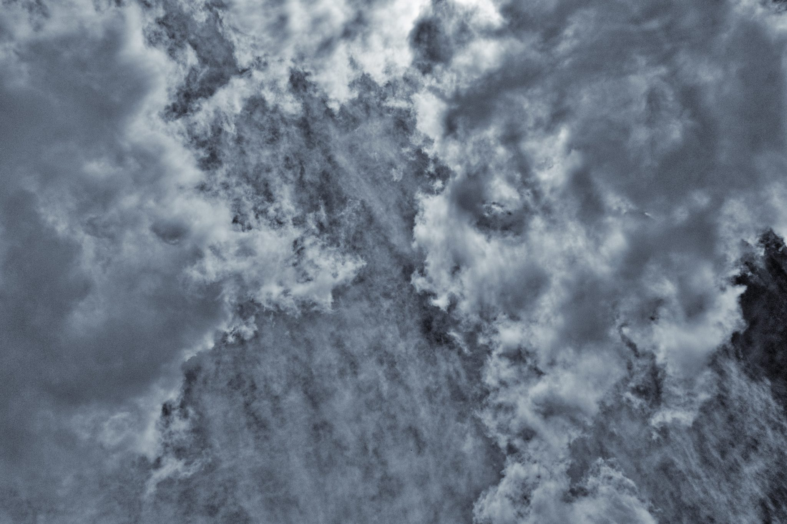
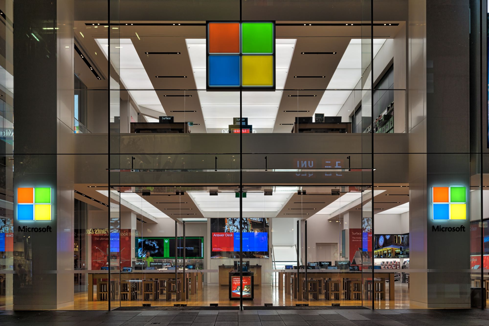
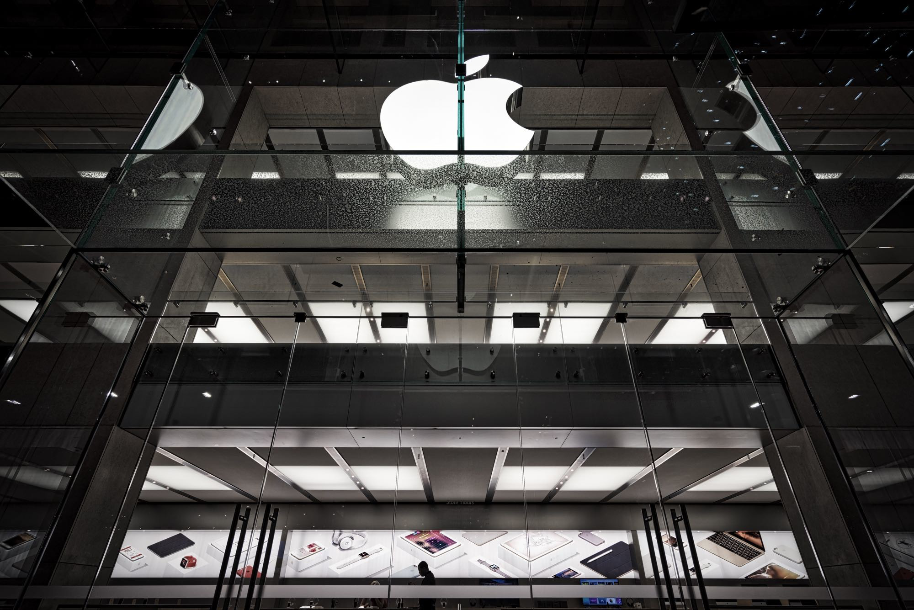

I have decided to make some controversial predictions for 2017. I don’t guarantee that these will come true, but I have tried to make them as controversial as possible. Feel free to disagree with me and post your own opinion.

My apologies for the somewhat negative nature of these predictions. I am not normally a doom and gloom person, but there is already way too much hype in the tech industry that I prefer to take a contrarian view.

By the way, all the photographs in this article are taken by me. No pixels were harmed during the process.

## ​1. Goodbye Uber

Racked by multiple lawsuits, saddled by regulations, and losing billions of dollars a year, Uber will soon find that they have to radically overhaul their business model, and they may even fail entirely.

Uber are over-investing in things like self-driving vehicles, and they may find (like Google and Apple did) that it is not so easy to create a completely safe, self-driving car. The problem is that the car has to deal with human drivers, who are unpredictable.

For future reference, read The Challenges of Partially Automated Driving​.

## 2. The end of Android

Operating systems are never easy to do, and the first child tends to be a bit klunky and ugly. Android is no exception, and the similarities between MS-DOS and Android are striking.

Both MS-DOS and Android are the result of a brash young companies purchasing something already existing (Seattle Computing Products and Android Inc respectively). Both “borrow” from established conventions (CP/M for MS-DOS, Linux and the Java APIs for Android).

Google have announced they are trying to merge Android and Chrome into a new operating system, and rumours say it will be called Andromeda. Or maybe it’s Fuchsia.

Reminds me of Apple in the dark days when they were trying to replace macOS with Pink, then Taligent, both of which failed spectacularly before Apple bought NeXT (which is based on Mach and BSD) and along with it the return of Steve Jobs.

## 3. Microsoft Linux

I must admit, 3 years ago I thought Microsoft would stagnate and die. Windows 8 was a disaster, and the company seemed to feel directionless in a post-PC world.

Microsoft has once again proved that it can turn on a dime. Just like it survived the Internet in the 90s, it has survived the Cloud in the 2010s. Microsoft’s offerings like Azure and Office 365 now seem relevant and on-point.

​But the biggest surprise is Microsoft’s embrace of competitor platforms. As a key Microsoft representative told me recently, Microsoft loves Linux and iOS (in fact, iOS has become Microsoft’s primary target for mobile computing after it has given up on phones).

I predict Microsoft will release a Linux distribution soon. No, not a desktop alternative to Windows, but a server based distribution optimised for cloud hosting and support for key Microsoft technologies like SQL Server. Who knows, Microsoft may even introduce a Windows Subsystem for Linux, to enable easy porting of Windows applications. Kind of like Wine, but officially supported by Microsoft. And complementary to the Linux Subsystem for Windows.

## 4. AI will not happen (yet) About Us

 About Us")

30 years ago, when I was doing my honours year in computer science, Artificial Intelligence (AI) was the Next Big Thing. It seemed with rapid advances in computing technology and algorithms, we were just one step away from achieving computing consciousness, ie. a sentient machine. That hasn’t happened.

Nothing has changed. Chat bots are still only slightly better than ELIZA, or perhaps Mark V. Shaney. All the advances in speech and image processing, machine learning etc. do not equate to true cognitive capability and self-awareness.

Same goes for Virtual Reality (VR). Still too dorky and fiddly.

## 5. The startup bubble bursts​​

Now that the Kickstarter poster child (Pebble) has died after being acquired by FitBit, and both Fitbit and GoPro have suffered a disastrous year (with stock price plummeting to a fraction of the previous year and declining sales and profits), it’s time to ask “Has startups gone out of fashion?”

It’s great and empowering to have your idea backed and funded by investors, and it is an extension of the American Dream that anyone can WHAM! ​​​Make It Big with the right idea and perseverance.

The reality however is that it takes a lot of effort to realise an idea, and even more effort to maintain relevancy. It’s no secret that many Kickstarter projects deliver late, if they deliver at all. FitBit and GoPro are learning that sustaining interest in a niche product is extremely challenging.

The other reality is the changing investment climate. Startups have benefited from a 30 year global decline in interest rates. Those interest rates are now on the way back up. Money isn’t going to be as readily available.

## But … what about Apple?

Let’s face it, the days when Apple can bet the entire company on a brand new product category that will wow the world are over. So it’s going to be more of the same, only better. Or worse, depending on your perspective.

So my prediction for Apple is that it will continue to iterate. It is a very different company today than when Steve Jobs was around. Some would say it has become boring, but others would argue it is a kinder, less arrogant company.