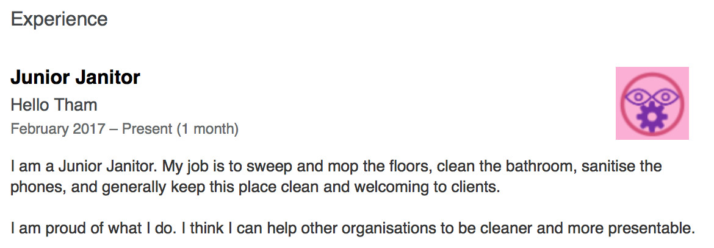

I updated my LinkedIn profile last week. I have recently established Hello Tham, a boutique management consulting company that showcases my consulting skills and hopefully those of my associates as well. I have created a[company page on LinkedIn](http://www.linkedin.com/company/17950469/), plus I also have a vanity web page at [www.hellotham.com](http://localhost/). We are @HelloThamCom on Facebook, Instagram, Pinterest and Twitter.

I took the opportunity of updating my [LinkedIn profile](http://linkedin.com/in/christham), and as the owner of my company, I suppose I can give myself any job title I wanted. Hmm … Executive Chairman of the Board, Chief Executive Officer, Managing Director, Managing Consultant, … the possibilities are endless.

In the end, I felt that grandiose self awarded job titles are silly. People who engage me for my services know me by reputation, they don’t really care what my company name is called and the title I give myself, so why not pick an unconventional job title?

When I was young, the advice often given to those starting a career is:

> *“You have to be willing to start at the bottom and work your way up.”*

And sometimes people will joke that starting at the very bottom means working as a janitor, or in the mail room. Indeed, Michael J. Fox starred in a rom-com called*“The Secret of My Success”*which basically has him starting as a mail boy in a large corporation and end up being the president by marrying the owner’s daughter.

I thought to myself: “Janitor” is fairly accurate description of the role I perform in my company, as well as the services I provide my clients.

The Oxford English Dictionary (V3) defines the word “janitor” as:

> **1. a.** *A door-keeper, porter, ostiary.*

I can certainly be regarded as the door-keeper or porter of my company. So far so good.

> **b.** *A caretaker of a building, esp. a school, who has charge of the cleaning, heating, etc., of it.*

Again, this is appropriate – I have to pay the bills etc. to keep the company as a going concern.

> **2.** *An usher in a school.*

Okay, this one is a bit of a stretch. I guess if I regard the company as a “school” where I learn what it means to own and run a company, but also a “school” where I teach my clients in the areas of strategy, or operating models, or enterprise architecture then I am the “usher” of that “school.”

As I am only just starting out, it is only appropriate that I prefix the title with the word “Junior.” After all, one of the definitions of the word in the OEDV3 is “of less standing or more recent appointment; of lower position, in a class, rank, profession, etc.” – that certainly fits the status of me and my company.

So … “Junior Janitor” it is. I updated my profile to include the following:

This caused LinkedIn to post an update to my connections:

The responses I received from my connections over the next few days were interesting.

> *Congrats on the new job! Let me know if you need help, I’m pretty wicked on a retro broom!*
>
> *Hi Chris I think your Linked In may have been hacked. In your experience there is a junior janitor role*
>
> *Congrats on the new job! Looks exciting … I think*
>
> *Congrats on the new role! Hope you’re doing well. Wtf?*
>
> *Hi Chris How are you. Is this you turning Entrepreneur?? Congrats anyways. Always liked the way you think. Quite Unconventional..*
>
> *Hi Chris – How are you – I saw your linked in update with your new status. Welcome to the consulting world*
>
> *Congratulations on your new position! The world can always do with more Junior Janitors!*
>
> *Hey Chris, how’s everything going? Saw your junior janitor post, you’re hilarious. That’s awesome.*
>
> *Well done Chris!*
>
> *Congratulations on your new position!*
>
> *What is this?*
>
> *Congrats on the new job! are you sure you have sufficient qualification and experience?*

I had quite a few of the vanilla “Congrats on the new job!” – I am guessing some people are clicking on the automatic reply button without looking too closely at the job title. Some think it’s a joke, or perhaps I have retired and this was my way of saying Sayonara to the world, others seem genuinely perplexed. I am pleasantly surprised quite a few people seem to have understood exactly what I was doing.

I do have some people who genuinely think I have committed professional suicide: the equivalent of harakiri or seppuku using words instead of a sword and knife.

Which leads me to think: how much of our working persona is defined by our job title? How do people perceive us professionally by a pair of words? How important is the job title to our career progression?

I don’t know the answers to these questions, but I am sure I will find out eventually. In the meantime, what do you think? Would you have done what I have done? What job title would you have chosen?