This year I attended my first conference in Hong Kong – RISE 2017, organised by the same people who do Web Summit in Europe. The conference was very focussed on the tech startup ecosystem and I really enjoyed it.

I arrived in Hong Kong on Monday the night before the conference starts. By time I had checked in to the hotel, it was too late to register and consequently I missed out on the pre-conference events (including cultural and pub crawls around Hong Kong’s expat districts, and a pre conference party) but that was okay as I was quite tired anyway.

## Day 1 (Tuesday)

Woke up at 5am Hong Kong time, which is actually around 7am Sydney time, so it wasn’t too bad. Decided to have a shower, and after that went out for a walk because it was too early for breakfast.

The streets are fairly empty at 6:30am, but already it was quite hot and humid. I walked towards the Hong Kong Conference and Exhibition Centre so that I can familiarise myself with the way getting there, and I was glad to see there are a few restaurants along the way that accept credit cards (pretty much a requirement for business travel in order to simply expense claims). However, they are mostly serving Western cuisine, but I did manage to find one selling Chinese food (Tasty HK).

The HKCEC is quite big, I think bigger than even the new ICC in Sydney. After that, I took the Sky Walk to Wan Chai station, and came out on Johnston Road.

From there I continue to walk East and managed to stumble into Bowrington Road Market – a huge wet market in the middle of Wan Chai / Causeway Bay. This market is pretty amazing and in your face – I was walking past pigs being butchered in the open air.

From there, I reached Canal Road and I remember there was a really good congee breakfast place here that a security guard at Times Square told us about many years ago.

After Canal Road, I headed back towards Jaffe Road and walked back to the hotel. Jaffe Road seems to be a little bit like Hardware Lane in Melbourne many years ago – it has many bathroom supplies stores and even a large hardware store with a huge tap in front.

I was starving when I reached the hotel. The breakfast buffet had an amazing selection, but surprisingly the food wasn’t that tasty. I had a ham, cheese and mushroom omelette that had too much cheese in it, and some fried rice with steamed broccoli leaves and fish, some French toast, congee, watermelon and some siu mai. Out of all that the siu mai was probably the most appetising – the others were only okay and I didn’t finish some of it.

After breakfast, we headed to the HKCE again to register for the RISE conference. Because we bought Women in Tech tickets, we had to queue up in the Women in Tech line and I felt this was a bit unnecessary – why cant we just check in through the normal registration booths where the line was moving faster?

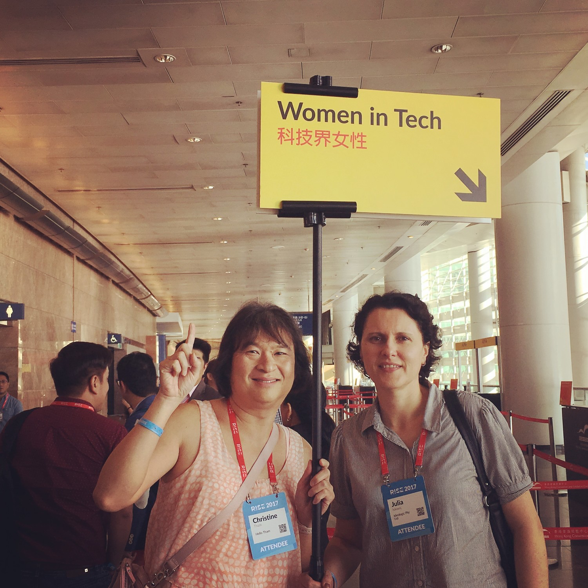

Security was very tight. Not only did we have to show our QR code ticket to even get to the registration booth, we had to show a photo id to register, and were then issued both an attendee badge as well as a wristband. Apparently the penalty for losing the wristband is over HK12,000! Then they scanned our attendee badge as well as checked out wristbands before we were allowed into the main hall.

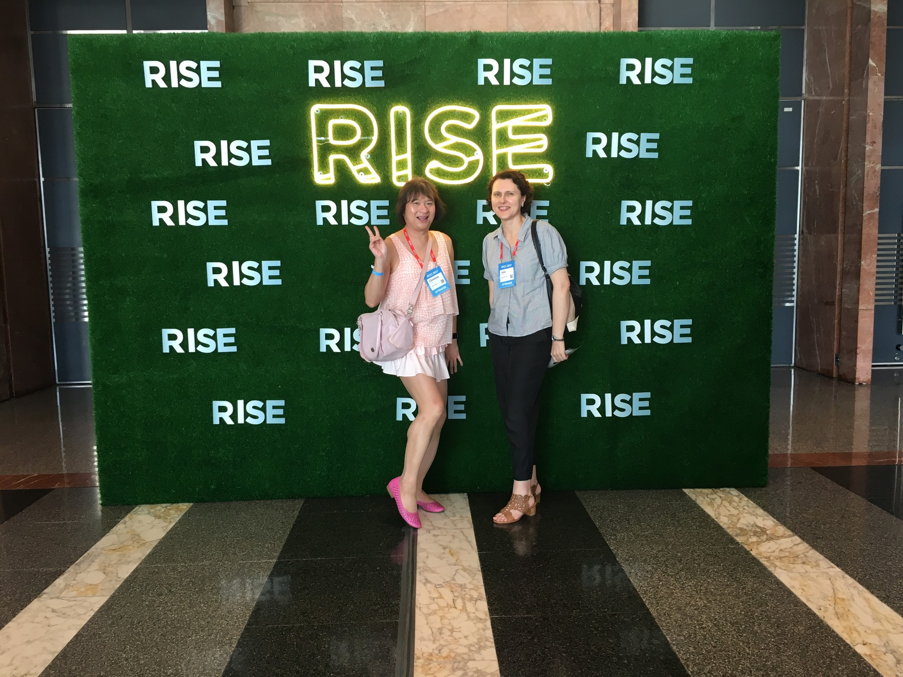

The conference is held in a very large hall partitioned into various curtained off stages where the presentations are, and a middle section full of booths with startups promoting their companies. There were a few sponsors such as AWS, KPMG and others but by and large the booths are small and allocated to startups. There was also an area where a startup pitch competition was underway. Each startup had only a few minutes to provide an overview of their offering judged by a panel. We saw a few of these – the quality was quite variable and I can see some startups can benefit from presentation coaching.

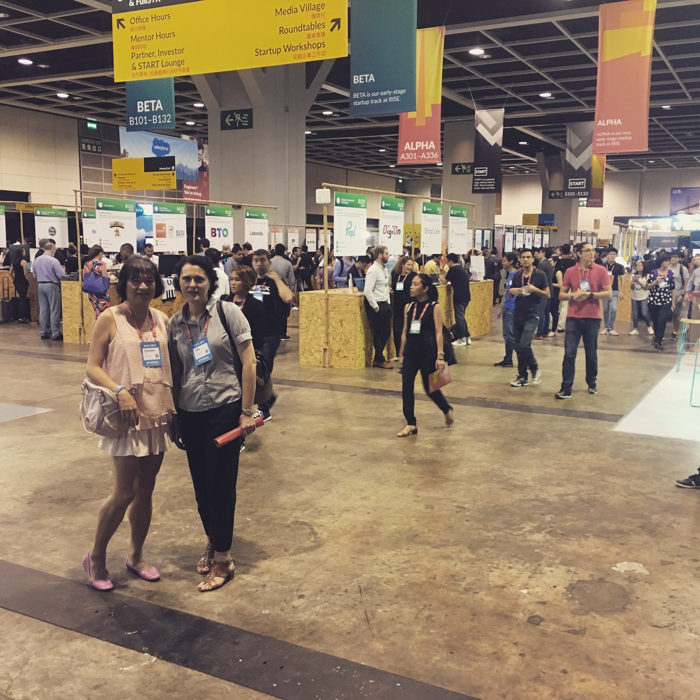

There were not enough seats to accomodate all attendees for the keynote session and we had to wait in a line outside. I can tell some attendees were disappointed by this.

There seemed to be about three parallel sessions of presentations, and it’s a mixture of solo speakers and panel sessions. I liked the brevity of the sessions – each lasted between 15-30 minutes. Two memorable sessions for me prior to lunch was one around open source design and another about data quality vs quantity.

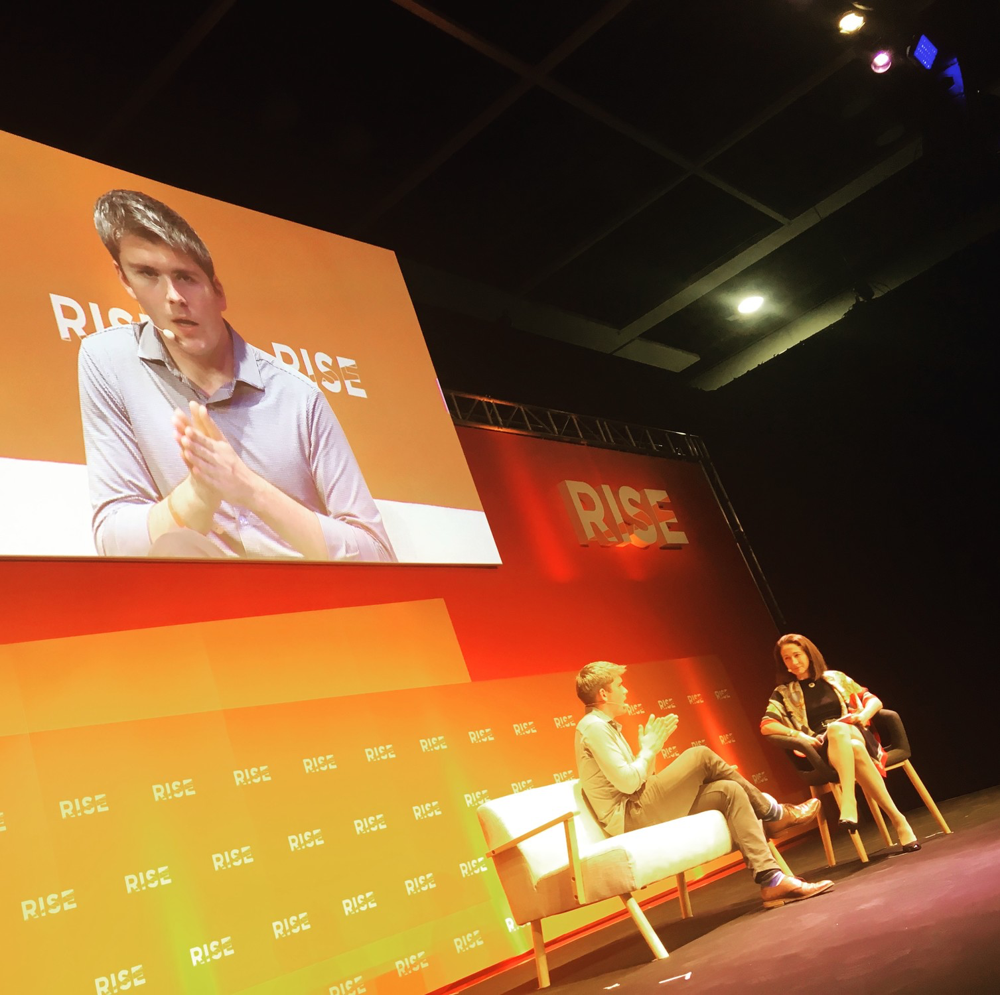

At lunch time I was a bit disappointed to discover we had to buy lunch (at rather exorbitant prices) – I am used to all meals being catered in conferences. We decided to head out rather than eat in the convention centre and discovered a great place called Tasty HK that had not only great food, good prices but also accepted VISA cards. I had an interesting fried rice sprinkled with pork floss on top and it was very nice.

There an interesting session in the afternoon which was a debate (The benefits of technology are worth giving up your privacy for). I thought both speakers were good but were essentially arguing the same position (privacy is disappearing but worth fighting for and there are certain steps you can take). It was very gratifying to see almost the entire audience (full of millennial startups) rejecting the proposition – looks like even the people supposedly killing our privacy don’t think the benefits are worth it and privacy is important.

By the end of the conference I was really tired. We decided to skip an after conference event which was about the HK startup toolbox and tried looking for a place for dinner. We went up to a seafood restaurant that was Michelin starred and had good reviews. The prices were amazingly expensive – in the end we decided to leave the restaurant and headed back to the same place where we had lunch. Here we had 5 courses for the price of the cheapest dish in the other restaurant.

I had to rush away to catch another post conference event – a “Startup Ferry” cruise around the harbour sponsored by one of the conference partners. I walked a long distance to get to Wan Chai MTR station, then walked quite a fair bit to get to Central Pier 7, and by the time I arrived I was very tired and sleepy and in no mood to party, so I ended up keeping my own company during the cruise and mainly took photos of the harbour. The crowd was very young and full of what I assume to be members of startup companies. It wasn’t really a good event for networking.

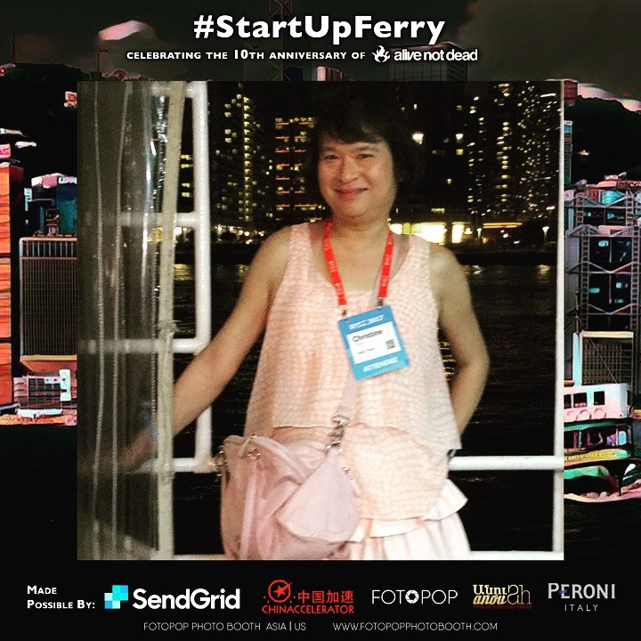

After the cruise, I headed back to the hotel and pretty much crashed into bed.

## Day 2 (Wednesday)

Went for another walk this morning – this time heading east towards Victoria Park but along the foreshore. Hong Kong seems to be embarking on yet another land reclamation project, as there is a lot of activity along the foreshore. At this rate soon Hong Kong island will be joined to Kowloon!

I walked past all the luxury car showrooms, starting with the Porsche dealership and ended up at Excelsior Hotel. Just when I reached Victoria Park, it started drizzling so I headed back to the hotel for breakfast. Now that I know lunch wasn’t provided at the conference, I had an absolutely huge breakfast that even my companions were starting to wonder where I was stuffing it all in.

Day 2 of the conference started with a keynote presentation from Sogou, China’s “Google” where the speaker was speaking in Mandarin and the presentation was dynamically being translated from Mandarin to English. We were all provided headsets to listen to the presentation in English. At first I thought the female voice coming through the headset was computer generated – she sounded quite monotonous and evenly paced, until I realised she was actually a human translator and the machine translation was on the screen. I was a lot less impressed – the machine translation was quite verbose and not as accurate as the human translator.

After that we had a panel session about whether China was “closing the gap” with Silicon Valley in terms of innovation and funding. I couldn’t help feeling the panel proponents were a tad biased – yes China has probably surpassed Silicon Valley in terms of amount of VC funding but as Julia pointed out it’s a country with over a billion people compared to a few suburbs in California. It is undeniably true though there seems to be an explosion of startup activity in Asia – one could perhaps even call it a “bubble”. Indeed, RISE seems to be structured as a sort of Tinder or matchmaking service between startups and investors. Someone even offered to introduce me to a Phillipines investor who was actively looking for startups to invest in. I declined.

I think the startup bubble is highly reminiscent of the Internet bubble of the 90s – everyone is madly creating yet another mobile app, the “Uber of X” or some sort of payment service, just like in the 90s when everyone was busy adding “i” or “e” in front things and creating websites.

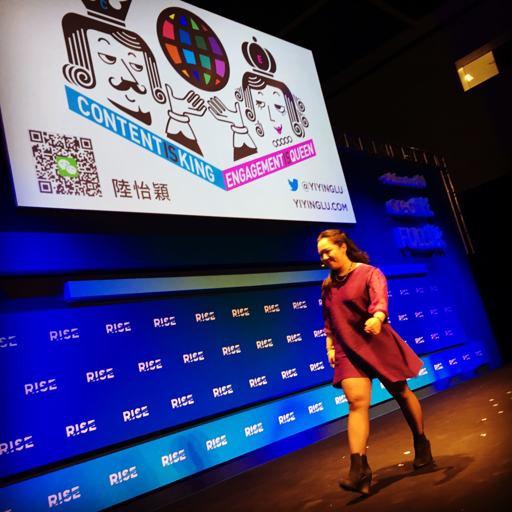

I particularly enjoyed the talk about “fake news” – a panel session consisting of various media representatives. Predictably the theme was about how the Internet with its focus on rewarding clicks or ad impressions have favoured quantity over quality and it has become difficult to determine what is true and what is fake. I do agree that newspapers have a structure that allows the reader to distinguish reporting from opinion pieces from advertising, but on the Internet all those have become blurred. I personally have reached the point where I try to rely less and less on random Internet articles and prefer to read the original source for any information, and even traditional news outlets have become less and less credible and trustworthy.

I was still quite full at lunchtime so we ended up just buying coffee from Pacific Coffee. I had my usual soy hazelnut latte and it was surprisingly quite good but expensive by Hong Kong standards.

After lunch we had a Q&A session with Gary Vaynerchuk, who was also the endnote speaker on Day 1. I must admit – I didn’t know who Gary was prior to the conference – but it seems I must be one of the very few who have never heard of him, and he is some sort of Internet marketing / online selling genius plus angel investor. He is an extremely good speaker, and I do agree with a lot of what he has to say. His main message is that now is the moment of startups and digital marketing, with low barriers to entry and an opportunity to capitalise on undervalued digital channels, but you have to give it your all and work really hard to get there.

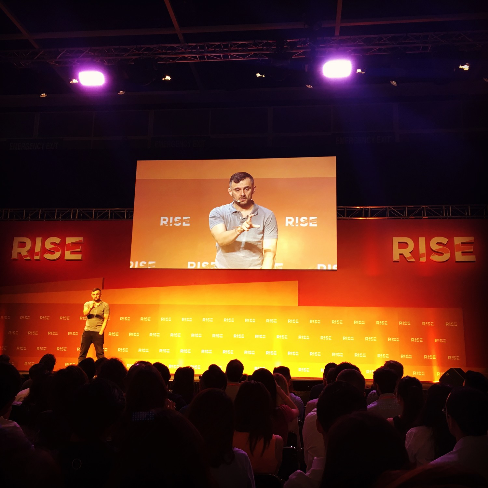

The endnote is delivered by Min Liang Tan, the exceedingly handsome Singaporean CEO of Razer – a company “for gamers by gamers.” I must admit, I am not a gamer and therefore wasn’t really aware of the products Razer sold – they started selling gaming mice and keyboards but are now into making laptops, services and even own THX. Min Liang now lives in San Francisco and initially spoke with an American accent but his tone become more and more Singaporean as he talked.

After the conference, we went to drinks at the Optimist (a local pub) hosted by Li & Fung, a large Hong Kong based supply chain company with a long history. It looks like Li & Fung is aware that their business model is rapidly eroding and quite desperate to pivot so they are very keen to talk to startups and connected to the modern disintemediated economy. I enjoyed this far better than yesterday’s #StartupFerry, as the audience was more corporate and we spoke to a number of Li & Fung people involved in innovation activities as well as a French expat who gave us a good history overview of the company as well as snippets of Hong Kong history.

I had two extremely large glasses of gin & tonic (Bodiga Pink) and that was pretty much enough to send me over the edge, so I left early and skipped the post conference party and headed straight to bed.

## Day 3 (Thursday)

Today I decided to do my morning walk to the west along Hennessy Road. I passed by a sign for a dentist called “Porky Chan” which brought a smile to my face. Speaking of smiles, I reflected on Gary Vaynerchuk’s exhortation yesterday for everyone to focus on “Being Happy” – and it occurred to me that few of us seem to be able to achieve that. As I look at the people on the streets – a mixture of early morning commuters and street vendors – some have faces that suggest they lead lives of “quiet desperation” (to paraphrase Pink Floyd as well as Thoreau). After two days of a conference where everyone was trying to figure out how to be a Unicorn or how to invest in one it was a reminder that there is still a Real World where people have to slog to earn a living in possibly a non glamorous job that will eventually be replaced by a chirpy robot imbued with augmented happiness and artificial EQ.

I reached the intersection with Queen’s Road East and headed back along it. The Road ascended and eventually I reached Wan Chai park. I climbed back down and went through the park. Despite the name, Wan Chai park did not have a lot of greenery but was heavily concretised. I passed a quaint shallow pool intended for Model Boats and immediately had a fantasy about building my own model boat and floating it in the pool.

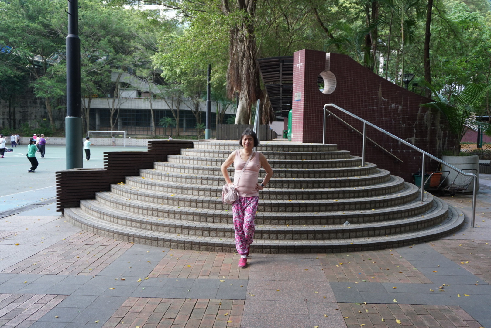

Back in the hotel I had another huge breakfast and headed to the conference. Today is the last day, and we have registered for the Women in Tech Roundtable. We were seated in groups of around ten people with a facilitator. Our facilitator was a pretty young Indian girl who had started her own Interior Design firm. The rest of the group was a mixture of women in different industries and professions and nationalities. One of the members of our group was also the invited speaker (Jaclyn Koh of the Busy Woman Project) who gave a nice talk about the challenges facing women today.

The topic of the Roundtable was about the challenges and key learnings for Female Founders. I really enjoyed the conversation and it was interesting how many shared experiences we have and how much we can learn from each other despite our different backgrounds. It was easily the highlight of the conference for me.

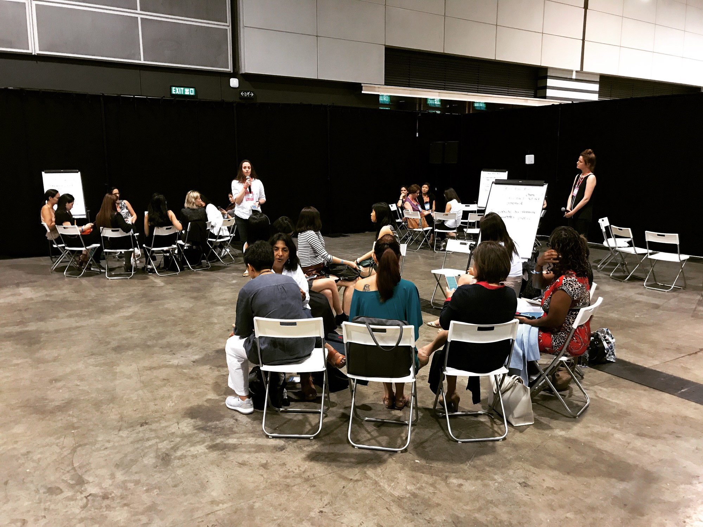

After that, we heard the top three finalists of the Pitch contest. From memory, one was Postco (providing a service to enable someone to order online and have the parcel delivered to a local cafe or similar rather than miss a collection), the second was Booqed (an Uber of temporary office space and meeting rooms) and the third was ZapZapMath (providing math education via a game like app).

I had a nice fried rice for lunch, but it made me feel really full and I think I would have felt asleep if we went into a session. Since it was the last day of the conference we took the opportunity to tour the startup booths. I was impressed by the range of startups and the diversity of the services they offered. Not everyone was writing a mobile app – some were actually offering hardware. My favourite was an NZ startup offering micro investing in ETFs (Sharesies) because their logo and branding colour is a very nice shade of pink.

Soon it was time to enter the main stage for the closing sessions. There was a session introducing the capabilities of TenCent’s enormously popular WeChat service/platform/lifestyle – part Facebook, part SnapChat and part payment service. The winner of the Pitch contest was announced- it was ZapZapMath. The final session was an interview with Paul Eremenko – the current CTO of Airbus Industry and the talk around across a number of topics including the Vahana single passenger personal flight “vehicle” (or, as Airbus calls it -“Urban Air Mobility”).

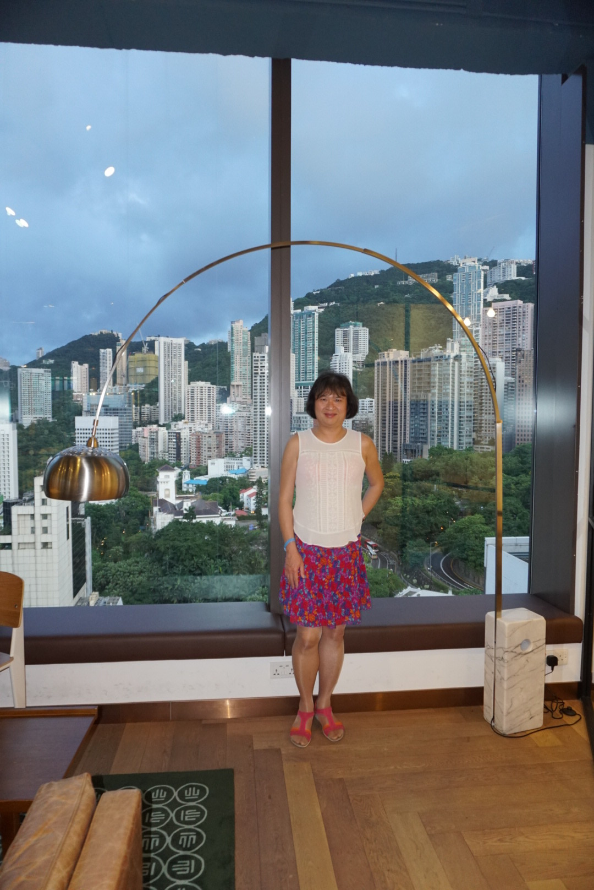

And suddenly it was all over – three days of conferencing. In the evening we attended a “fireside chat” about AI and Future Tech. I found this boring despite the calibre of the speakers so we left early and decided to walk back to the hotel. Although Apple maps said it should take about 30 minutes it ended up taking almost an hour due partly to us not knowing exactly where to go (Apple Maps isn’t public transport or walking optimised for Hong Kong so it doesn’t know about the elevated pedestrian walkways for example.

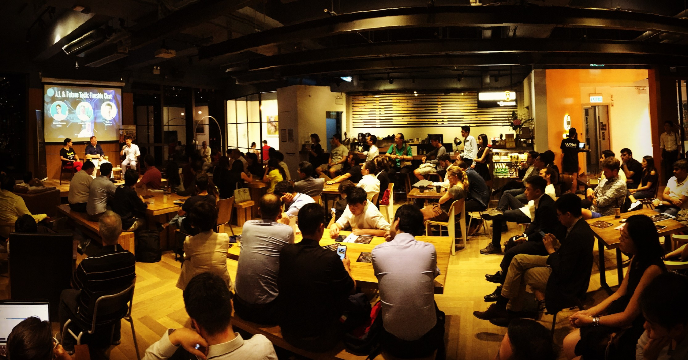

On the way we passed through Chater Park and a huge lantern installation celebrating the 20th anniversary of the handover of Hong Kong back to China. This was quite interesting and colourful. I was very very tired when we finally reached the hotel and pretty much crashed into bed.