Were you forced to memorise the multiplication table at school? Did you find it difficult, and wish there was an easier way to derive the multiplication table using a few simple rules rather than memorising the entire table?

Recently I saw a video on Facebook about how you can easily multiply by 9 because if we write out the “times 9” column in the multiplication table, it looks something like this:

```
 1 x 9 = 09
 2 x 9 = 18
 3 x 9 = 27
 4 x 9 = 36
 5 x 9 = 45
 6 x 9 = 54
 7 x 9 = 63
 8 x 9 = 72
 9 x 9 = 81
10 x 9 = 90
```

Notice how symmetrical the results are? If we examine the left digit, they ascend from 0 to 9 whilst the right digit descend from 9 to 0.

This led me to wondering whether there are any similar patterns for the other digits. Clearly there are some: multiplying by 1 gives an ascending set of digits, multiplying by two gives us all the even numbers, and multiplying by 5 has the left digit ascending in groups of 2, whilst the right digit oscillates between 0 and 5.

What about the other digits? I decided to visualise the multiplication table in Tableau. First of all I constructed a multiplication table in Excel, looking like this:

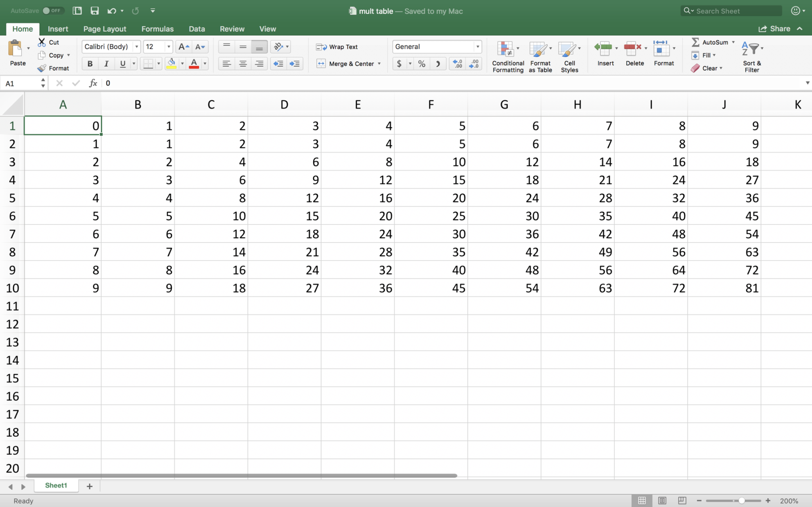

I then uploaded it into Tableau, and after some fiddling, managed to replicate the table:

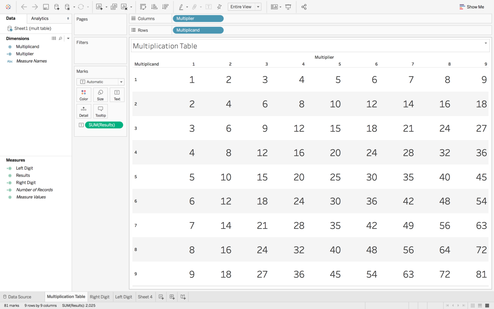

What I really wanted to do was to look for patterns in the left digit and right digit of the results, so I created two calculated fields:

```
Left Digit = INT([Results]/10)
Right Digit = [Results]%10
```

I initially started focusing on the Right Digit. Creating a scatter diagram between the Multiplicand and the Right Digit generated this pattern:

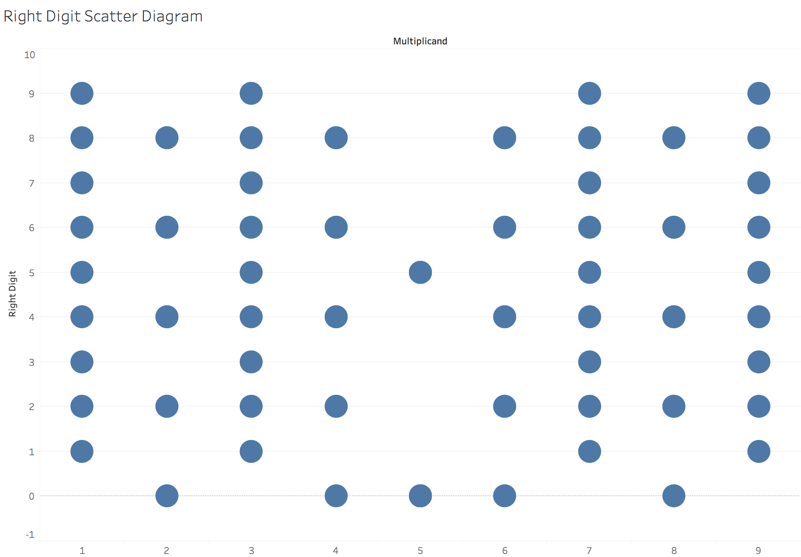

Now there seems to be some sort of pattern, for example all the odd multipliers (except for 5) generated all possible digits, and the even multipliers only generated even digits (as you would expect). Multiplying by 5 will always result in a number ending with either 5 or 0.

What if we were to colour code by the multiplier?

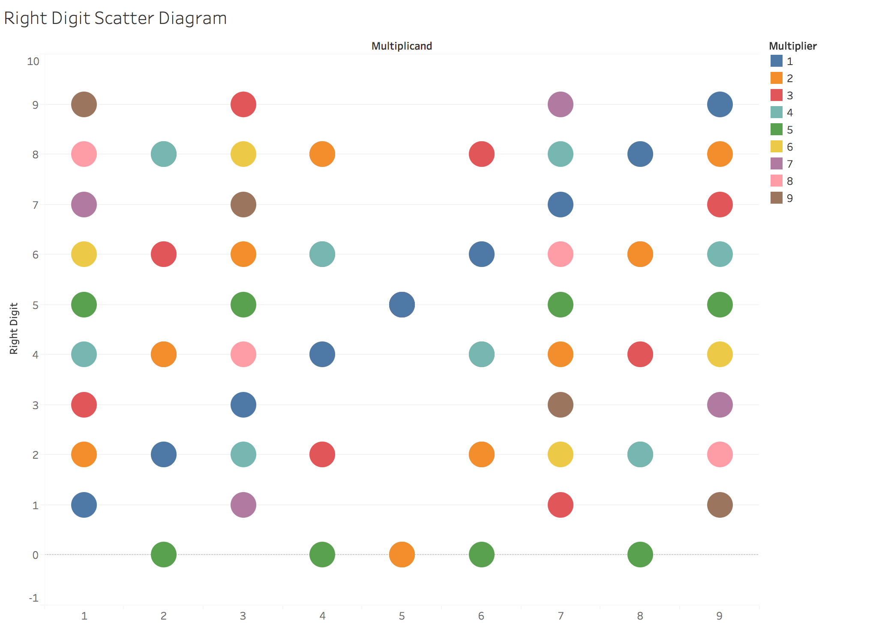

Now we seem to have lost some of the symmetry. However, I think this is because some of the circles are actually multiple different coloured circles all on top of each other.

Next, I drew lines (by multiplier) connecting the circles:


Now we can definitely see that pairs of multipliers that appear to be opposites of each other. If this is not clear from the above diagram, let’s look at each pair. The first is the multipliers 1 and 9:

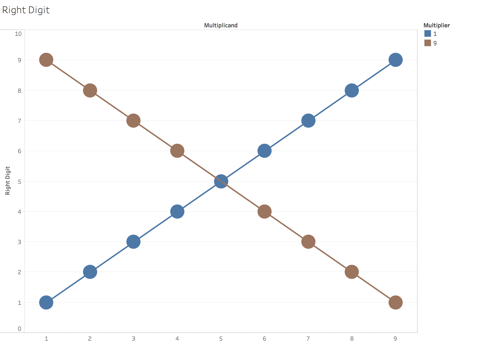

Clearly, the pattern of right digits for multipliers 1 and 9 are mirror images of each other. From this, a hypothesis can be generated that the same is true for the other pairs (2 and 8, 3 and 7, 4 and 6).

This is certainly true of 2 and 8:

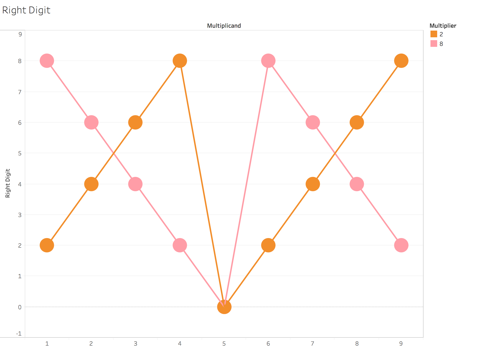

Multipler 3 creates a beautiful zig zag pattern of 3-6-9 followed by triplets with digits 1 less than the previous (2-5-8 and 1-4-7) – notice how the result is also a permutation of the original digits (1-9):

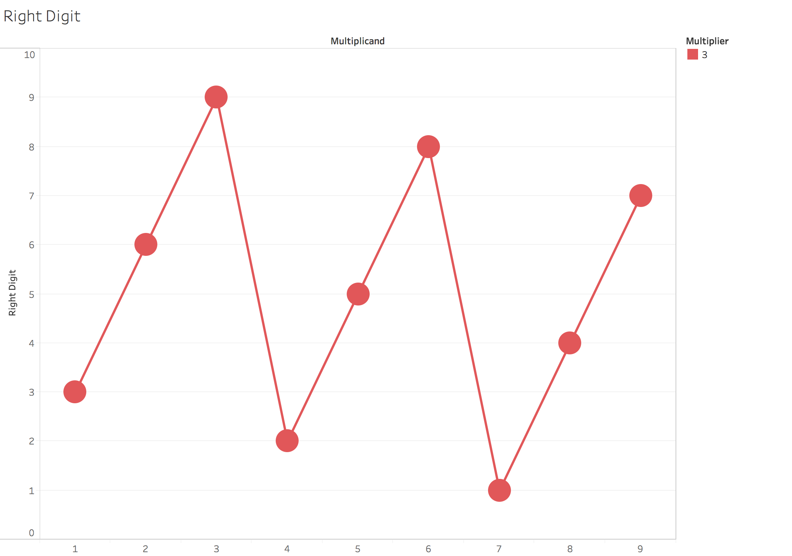

I can’t help wondering if the Christian reverence for the number 3 (The Holy Trinity) is augmented by this beautiful symmetrical pattern. And of course, the pattern for 7 is reversed but just as beautiful (and we all know there is 7 days in the week, and God created the Universe in 6 days and rested on the 7th):

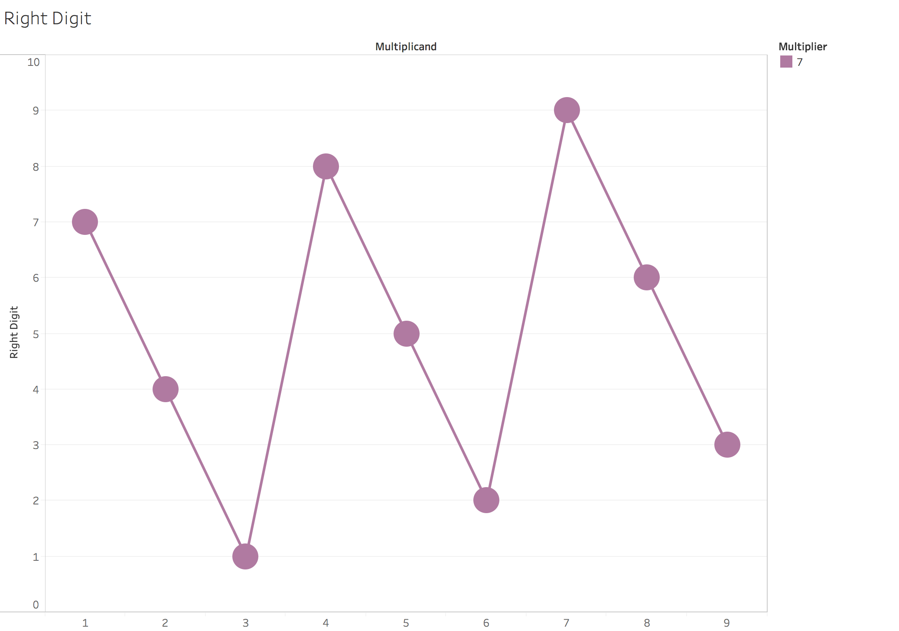

The multipliers 4 and 8 create a pattern 4-8-2-6 that is reminiscent of the pattern for 3 and 7:

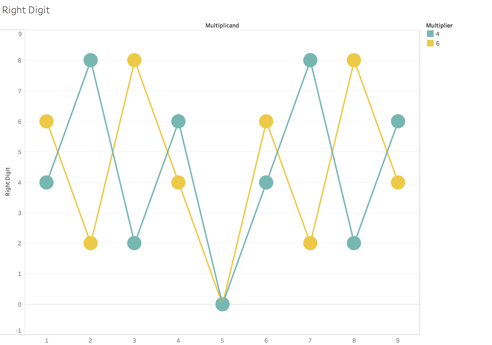

And finally the multiplier 5 stands on its own as it is symmetrical:

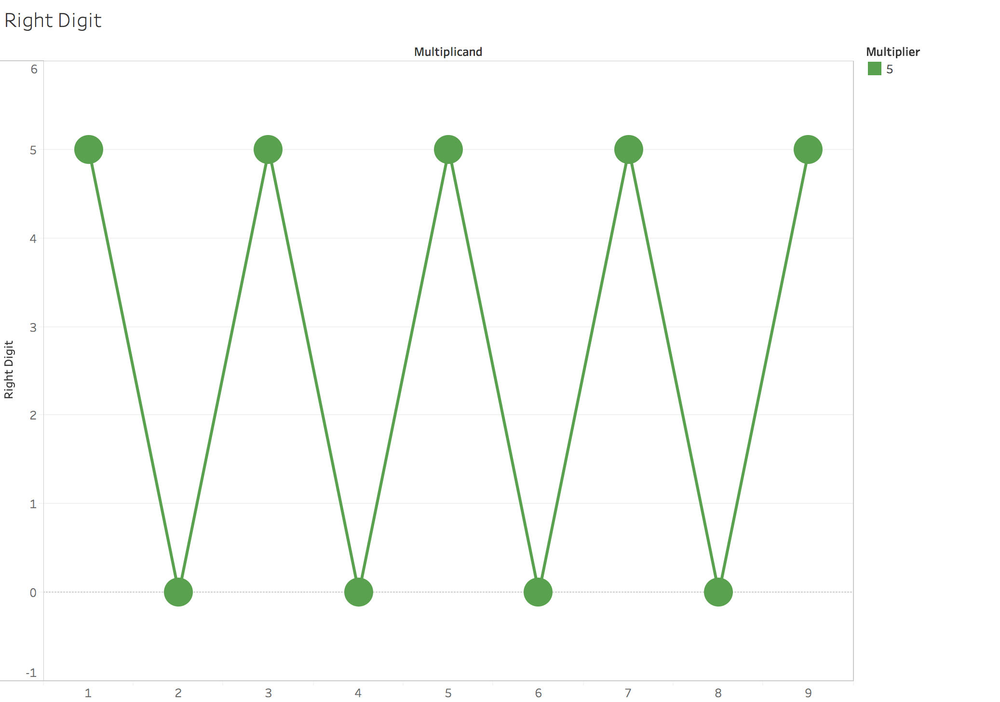

The pattern for the left digit looks deceptively simple but not as symmetrical:

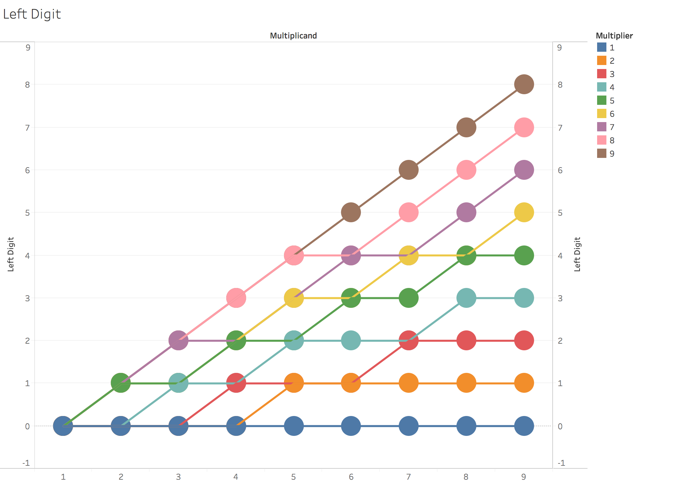

To see how the left digit is derived, we have observe that it acts as an “overflow” for the right digit – it increases whenever the right digit is smaller than the previous right digit. This is clearly illustrated for multiplier 2 but is true for all the other digits as well:

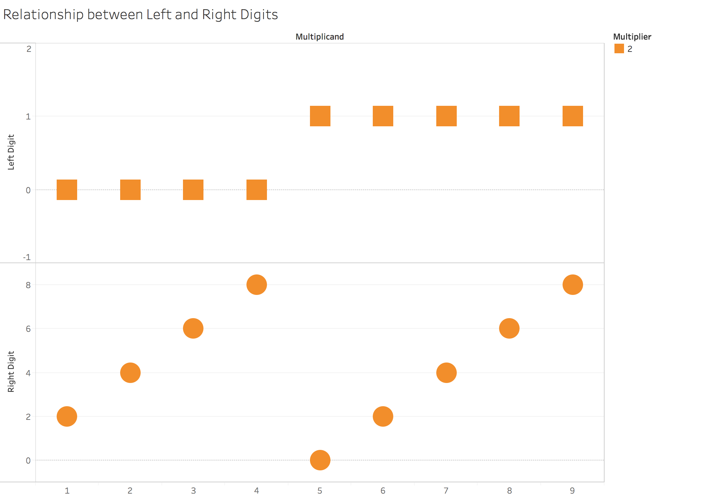

In summary, we can derive the multiplication table easily with a few simple rules:

The right digits have a pattern in pairs 1-9, 2-8, 3-7, 4-6 where the pattern of the latter is a reverse of the former.

* The pattern for digit 1 (and 9) is and ascending set of digits (reversed for 9).
* The pattern for digit 2 is an ascending sequence of the even digits, repeated. Reverse for 8.
* The pattern for digit 3 is a repeating triplet pattern (3-6-9, 2-5-8, 1-4-7). Reverse for 7.
* The pattern for digit 4 is a repeating quadruplet pattern (4-8-2-6), repeated. Reverse for 6.
* The pattern for digit 5 is alternating 0 and 5.
* The left digit acts as an overflow for the right digit, and increments whenever consecutive right digits decrease.

One observation I made after gaining the above insights is how a lot of units of time and measurement are based on these multiples. Examples:

* `2x3x4 = 24`(the number of hours in a day)
* `2x3x5 = 30`(the approximate number of days in a month)
* `3x4 = 12`(the number of months in a year)
* `3x4x5 = 60`(the number of seconds in a minute, or the number of minutes in an hour)
* `2x3x3x4x5 = 360`(the number of degrees in a circle, or the approximate number of days in a year)

Creating units that are multiples of the various digits makes them easily divisible (by halves, thirds, quarters etc.), and helps explain why these units were chosen in the first place.