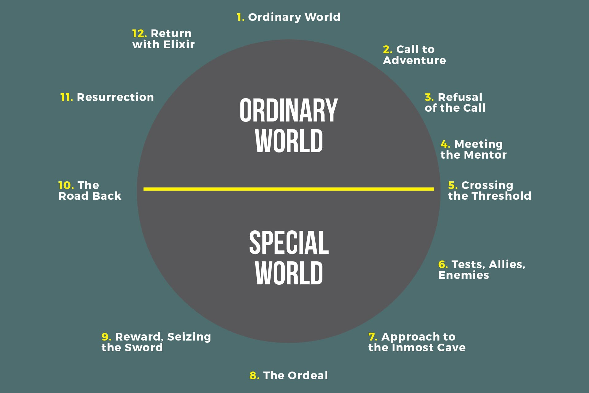

This is the second part of my series of articles on learning to code at age 55 and creating some prototypes. For the first part, click on [From Zero to Hero (hopefully) – Part 1 (Learning ServiceNow and Xcode/Swift)](/blog/2018-11-01-from-zero-to-hero-hopefully-–-part-1-learning-servicenow-and-xcode-swift/). In today’s article I provide an update on my learning progress, hustling a team together and some observations and self-reflection on the journey.

In my first article, I referenced The Hero’s Journey. Joseph Campbell, a mythologist, noticed that myths and stories frequently share a fundamental structure. In his book *The Hero with a Thousand Faces*, Campbell summarises the journey as:

> A hero ventures forth from the world of common day into a region of supernatural wonder: fabulous forces are there encountered and a decisive victory is won: the hero comes back from this mysterious adventure with the power to bestow boons on his fellow man.

For more information, refer to the Wikipedia article [The Hero’s Journey](https://en.wikipedia.org/wiki/Hero%27s_journey). In the context of my own adventure, I have now crossed the threshold from the ordinary world into the special world and will be encountering **Tests**, **Allies** and **Enemies**:

## Tests (my learning progress)

In the interests of anyone else who may be contemplating or embarking on a similar journey, I will share the learning tools and paths I am using.

### ServiceNow

Learning ServiceNow is relatively easy (being able to effectively develop apps on it is a different story – more on this later).

Just create an account on <https://developer.servicenow.com/> and create a developer instance and then follow the learning plans. There’s a variety of plans to choose from (*New to ServiceNow, ServiceNow Administrator, ServiceNow Application Developer, Technology Partner Program* etc.). I have now completed the *Technology Partner Program Quick Start* and about halfway through the *New to ServiceNow* lessons.

Following the lessons were fairly easy, as all I am doing is reading and being a typing monkey replicating the lessons. The conceptual underpinnings are not so easy and will require time to master. Moving beyond tables, fields and forms into actions, triggers, business logic etc. requires knowledge of Javascript. Although ServiceNow tries to minimise the Javascript scripting required and have created no-code versions of common scenarios, coding is required for complex logic.

I don’t have a lot of familiarity with Javascript – I have written Javascript a long long time ago and I do have some familiarity with HTML5 and CSS and a slight awareness of frameworks such as Angular and React but not much more. However, I found it easy to read the code examples as the language is vaguely C-like.

My feeling is that developing non-trivial apps on ServiceNow is similar to any other development platform, code-free or otherwise. Software development skills are required. ServiceNow is a web cloud hosted app, and the development environment is browser-based, which I found a bit sluggish, especially on a congested 4G network. I wish there was a native IDE available, or perhaps the possibility of self-hosting a developer instance locally.

### Swift/Xcode

With Swift, I started by reading the Swift book, but I found it very heavy going. Then I discovered there is a great course of iTunes U called [Developing iOS 11 Apps with Swift](https://itunes.apple.com/au/course/developing-ios-11-apps-with-swift/id1309275316). It is aimed at University undergraduates and assumes a background in computer science.

I quickly found that this course is probably a bit too intense for me, as my skills are rusty. I then found two books on the Apple Books store called [“Intro to App Development with Swift”](https://itunes.apple.com/au/book/intro-to-app-development-with-swift/id1118575552?mt=11) and [“App Development with Swift”](https://itunes.apple.com/au/book/app-development-with-swift/id1219117996?mt=11) by Apple Education, released as part of the “Everyone Can Code” series. These are aimed at high school students, and I found these a lot easier to absorb.

My impression so far is that Swift is a modern language with a clean syntax, and far superior to Objective C which is ugly, verbose and complex. However, underneath the nice clean Pythonesque syntax Swift is still a complex language, at least as complex as C++ and definitely more complex than Java. I applaud Apple’s attempts at making the language accessible through initiatives like Swift Playgrounds on the iPad and macOS.

I also really liked Xcode. Not having a great deal of experience with modern IDEs, I can’t comment on Xcode vs other popular IDEs but it seems to be quite clean and uncluttered and reasonably easy to pick up (typical for Apple apps).

## Allies (Hustling to get the band together)

In my previous article, I mentioned that at least one other person will be sharing the journey with me. I have been spending the last week or so getting a group of people together to form a team so we can deliver the prototypes.

In March 2012, Rei Inamoto, Chief Innovation Officer at AKQA spoke at SXSW and opined that:

> “To run an efficient team, you only need three people: a Hipster, a Hacker, and a Hustler.”

Since then, a lot of hackathon teams have organised themselves around these three roles. In the context in this initiative, my natural strength is to be the Hustler – I am good at evangelising and selling the concept, and reaching out and connecting to potential partners and enablers.

In addition to the client (acting as the Business Owner and Sponsor of our work) and myself, I have persuaded at least three other people to join us in the journey. So we now have a Hacker, who will be responsible for doing the coding and integrating, the Hipster, who will be responsible for documenting the use cases and workflows (and requirements generally), and a Technical Architect who is acting as the Enabler to get the platform and environment going. In addition, I am starting to reach out to people who can assist us on the journey, including the vendors (Apple, SAP and ServiceNow) and other teams within the client organisation.

We spent a good part of a day brainstorming ideas and use cases for the prototype. The client gave us good guidance on criteria for selecting ideas and use cases. We then spent another day confirming the approach, plan and timelines, as well as actions that we have assigned to ourselves based on our respective roles. I was pleased to see that we worked well together as a team and complemented each other’s skills. We also have some interest from vendors in helping us on the journey.

An interesting insight for me is how I have instinctively reframed my journey to leverage my strengths (as an evangelist and “connector”) to augment my deficiencies (lack of technical skills). As an extrovert, I naturally prefer talking to people than spending a day coding (which brings me to my natural enemies, which I am going to reflect on below).

## Enemies (lack of focus and time)

Reflecting on my progress so far, I would say two factors that have hindered me so far are a lack of focus and a lack of time. I started with all the good intentions of burying myself and concentrate on learning ServiceNow and Swift/Xcode as quickly and efficiently as possible.

Instead, what I have found is that I can’t spend more than about 3 hours going through tutorials and lessons without getting agitated, and I have been distracted on a number of occasions. For example, on Monday, I spent a lot of time helping my client out with another problem.

I am also finding it difficult to get quality time to do self study. This week for example, I have attended an SAP session introducing the capabilities of their mobile services platform, and I am also attending a bootcamp on Human Centred Design (which will flow into next week). Also, I am attending an Apple workshop learning how to code native iOS apps with the SAP Cloud Platform SDK. Whilst all these sessions are highly relevant to the journey, I also need to find time in between to focus on self study. For example, I need to be up to speed on Swift and Xcode prior to the Apple workshop.

I was planning to do some self study last weekend, but ended up attending the Sydney Open Festival as I have already bought tickets. This weekend we are planning to visit the Wollombi Sculpture in the Vineyards event. I am wondering how I will find time to study.

Another enemy is Lack of Focus, and I was reminded of this earlier in the week. We attended an SAP session where they introduced cool SAP mobility technologies which my team and I became excited over and we started talking about how to include these technologies in our prototypes. My client then called me up and we had a long conversation. My client reminded me that whilst these technologies were very interesting, they were distracting us from what we actually needed to deliver and was outside the scope of the prototypes. The lesson learnt here is to be laser focused on the scope and objectives on the journey and not be distracted by the scenery and any pretty items we may encounter along the way.

That’s all for this update and I hope to share more of our journey next time.
