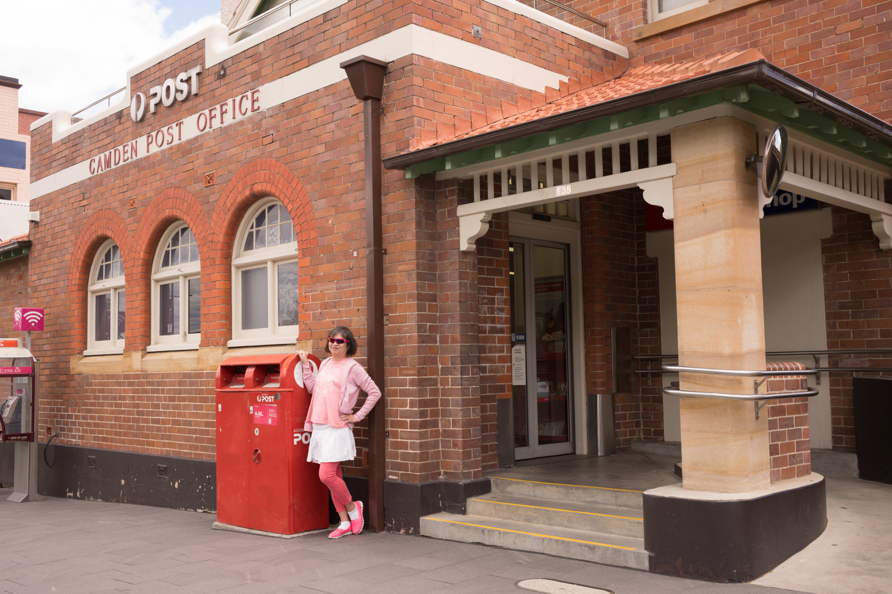

Previous articles in the series are:

* [Part 1 (Learning ServiceNow and Xcode/Swift)](/blog/2018-11-01-from-zero-to-hero-hopefully-–-part-1-learning-servicenow-and-xcode-swift/)
* [Part 2 (Learnin’ and Hustlin’)](/blog/2018-11-08-from-zero-to-hero-hopefully-–-part-2-learnin’%E2%80%8B-and-hustlin’%E2%80%8B/)
* [Part 3 (Approaching the Innermost Cave)](/blog/2018-11-21-from-zero-to-hero-hopefully-–-part-3-approach-to-the-inmost-cave/)

We have organised ourselves around weekly Sprints, with a daily 15 min check-in and a Show and Tell demo session every Friday with our stakeholders. We are currently in the middle of Sprint 2 (week 2).

## Week 1 Sprint 1

Last week was extraordinarily successful, well beyond (mine at least) initial expectations.

First of all, we managed to get Mobile Services enabled on our instance of the SAP Cloud Platform. The client’s Platform Manager successfully installed SAP Cloud Connector on a temporary server and connected to the SAP dev environment. After some discussion around the security architecture, our Hacker managed to successfully create a sample application via the SAP SDK for iOS assistant connecting to Mobile Services and successfully accessing some existing services turned on in the dev environment. Yay!

Our Hipster also identified some BAPI services we can use for our prototype. The challenge this week is to instantiate some Odata services based on the BAPI functions so we can connect our prototype to them.

On my part, I had a wild rollercoaster journey. Last Wednesday, I managed to get a successful bare bones app working with the minimal number of screens, and some sample in-app data that can be used to drive the prototype.

The most frustrating thing I have encountered so far is getting constraints correct in Interface Builder. I discovered there is a real art to working with stack views, and positioning UI elements with just the right constraints to anchor them to the screen. My initial approach, which is to over-specify constraints, turned out to be just as bad as under-specifying them. Interface Builder needs just enough free dimensions in order to fit everything together. I spent many frustrating hours staring at red bars and constraint warnings.

On Thursday, suddenly magic happened. Not only was I able to resolve all my issues, I ended up with something that I could demo to my client. To my surprise, he liked it. He said he didn’t really understand what the app did from my wireframe hand drawn sketches, but now that he has seen it in action, he finally understood it and thought it was cool. He asked me to demo it to his boss, which I did late on Thu.

On Friday, we demoed it to a few stakeholders and it became a conversation piece during Friday evening drinks at the local pub. I managed to enhance the prototype by adding a table view controller and a customised table cell that segues to a detail view. I also managed to figure out (with some help) how to load it to my iPhone X so that we can use some of the gestures like the Shake Gesture to control the app. Very late on Friday, I managed to integrate phone calling, messaging and email into the app – this turned out to be a lot simpler than I had anticipated.

## Eating and Drinking

It was great to enter the weekend knowing we had a successful Sprint 1, and I can finally take some time to relax (the last two weekends I was busy learning Swift).

On Saturday we visited Camden, a historical town on the outskirts of Sydney as they were having their annual Jacaranda Festival.

We had a great lunch at a vegetarian restaurant in Canley Heights and spent the afternoon looking the sculptures at Sydney Olympic Park:

On Sunday a friend of mine hosted a Gin and High Tea ladies afternoon. A group of us sampled some really interesting gin concoctions and a variety of sweet and savoury dishes. We each had to contribute a dish and after some soul searching I decided to make some smoked salmon and avocado sandwiches on rye crisp bread. I added some goats cheese and truffle, and garnished with cucumber, mint and sprinkled some fried onions on top. I also sprinkled a bit of olive oil and raspberry balsamic vinegar.

On Sunday night I ended up ironing for several hours (I had backlog of several weeks to clear as I have been busy learning Swift). I also finally settled to some piano practice (I have been trying to learn a new song) and very happy to make some progress towards memorising the song.

## Week 2 Sprint 2

Yesterday we demoed our prototype to Apple at their headquarters in “Silicon Place” (in reality Martin Place, but a lot of tech companies are now located there and Apple is in the same building as Tesla and Tableau, so Sydneysiders have started giving it a new nickname).

The demo went well. Apple gave us some nice feedback on some additional things we can consider, such as enhanced functionality. They also mentioned some technology they have acquired that allow indoor locations to be mappable and locatable using Wi Fi access points. They promised to send me some details and hopefully we can incorporate some aspects of it in our prototype.

I am currently back to being frustrated again, as I am struggling to learn Microsoft Graph so that I can hook our app to Office 365 to retrieve contact details and hopefully achieve Skype and Outlook integration. I am working from home because it is bucketing rain outside and the streets are soaked. Buh-bye for now and hope you have been enjoying reading the series so far!