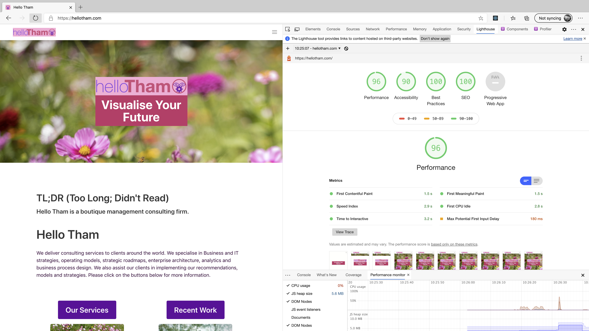
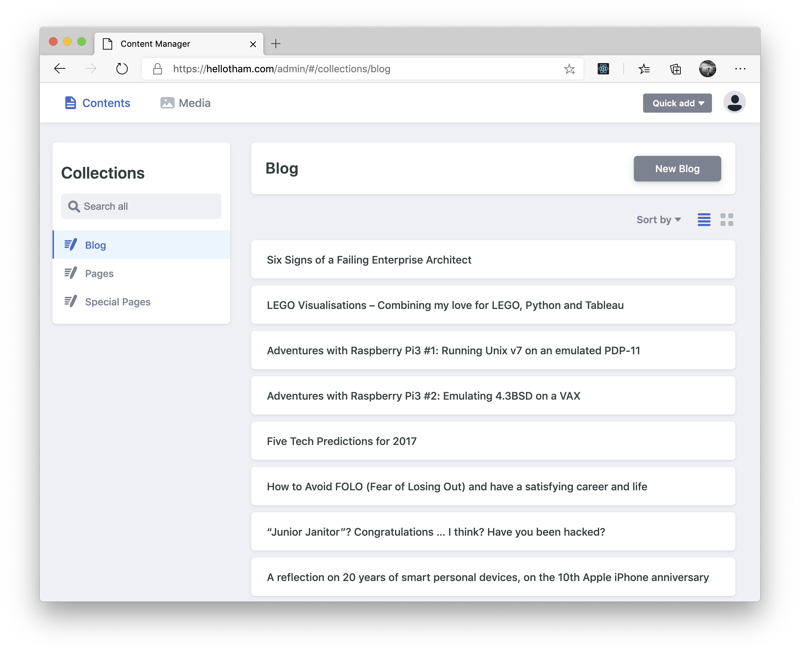

Ever since our company was established (in 2016), our web site has been built using the industry leading content management system
[WordPress](https://wordpress.org), currently used in over 60 million websites around the world
(according to [Wikipedia](https://en.wikipedia.org/wiki/WordPress)).

Why did we choose to change and rewrite our site completely? Is there something wrong with WordPress?

No, WordPress is still great, easy to use, has tons of beautiful themes and powerful plugins, and you can literally do anything you want in WordPress to produce excellent functional and usable websites. We still use WordPress to create websites for some of our clients.

However, there has been a revolution in web app development, architecture and deployment in the last few years, and we believe now is the perfect time to switch to the new and better way of the future.

Our new web site is rewritten from the ground up as a modern, serverless, web app - deployed globally.

What does this mean exactly? Traditional web sites require a backend server and is relatively difficult to deploy and scale to achieve the near 100% availability that anyone would expect of any website today. Even on the cloud, deploying a scalable, performant, highly available website can be challenging. As an example, the following diagram illustrates AWS recommendations for deploying and hosting a WordPress website:

Many companies and web agencies choose to use a managed WordPress hosting provider that takes care of the complex deployment architecture for you, and ensure your site remains up, secure, fast and updated.

However, your website will still be slow and inaccessible if your website is hosted in, say, Sydney Australia, and someone is accessing it from Africa, Asia, South America or perhaps parts of Europe and conceivably even in USA on a bad day in a remote location.

To solve that problem, good web hosting platforms/providers typically speed up your website by putting a **content delivery network**, or **content distribution network**(**CDN**), in front of your website. In the AWS reference architecture above, [Amazon CloudFront](https://aws.amazon.com/cloudfront/) is a CDN service offered by AWS.

A CDN takes static, pre-rendered versions of your web pages, and deploys them globally to many locations around the world, so that when someone accesses your website, they are accessing a local copy of your content at the location nearest to them, no matter where they are in the world. This works great, but does mean that all those locations need to be refreshed every time you make a change or release new content to your website.

However, in the last few years, an alternate website deployment architecture has emerged. Variously referred to as serverless, static web apps, or [JAMstack](https://jamstack.org), the concept is fairly simple. If the ideal scenario for serving content for a website is via a CDN, which not just deploy a set of static web files directly to the CDN, and no backend server is required!

The benefits are immediate and fairly obvious:

* ***there is no server***, nothing to manage, configure, patch, upgrade, or monitor
* web hosting costs are dramatically lower, and quite likely ***zero cost***, as you are only paying for a CDN service (which many providers including AWS offer for free up to a generous limit)
* no server means the ***security of your website is guaranteed***, there is nothing for a hacker to access or login to (the worst that can happen is someone compromises the CDN service and corrupts your files, in which case you can just redeploy in minutes to overwrite the content)
* the web site content is always ***up to date and refreshed,*** you never have to worry about the slight possibility that someone is accessing an older copy of your website because the CDN wasn't refreshed correctly (this happens more often than people like to admit, depending on how you have configured your website)
* your website is ***global and always fast*** as it is a set of static web files that is served from a CDN, from potentially hundreds (or even thousands) of locations around the world (depending on your CDN provider)
* you ***don't need to worry about SEO*** (search engine optimisation) (search engines generally like static fast content and tend to rank them high)

Our new website is fast. How fast? Our LightHouse score is 96:

The Hello Tham website is now a web app written (based on the
[gatsby-starter-netlify-cms](https://github.com/netlify-templates/gatsby-starter-netlify-cms) starter)
using the following technologies:

* JavaScript, HTML and CSS - the building blocks of the [World Wide Web](https://www.w3.org/)
* [Markdown](https://daringfireball.net/projects/markdown/) - a simple, easy to learn and lightweight text markup language for creating web content
* [React](https://reactjs.org/) - a JavaScript library for building interactive web applications originally created by [Facebook](https://developers.facebook.com/products/#open-source)
* [Bulma](https://bulma.io/) - a CSS framework used for designing the responsive user experience and user interface
* [Gatsby](https://www.gatsbyjs.org/) - a framework for developing and generating static web apps (it's creators envisioned it as "What WordPress would look like if it was designed in 2020")
* [GraphQL](https://graphql.org/) - a query language for accessing content dynamically, also originally created by [Facebook](https://developers.facebook.com/products/#open-source)
* [NetlifyCMS](https://www.netlifycms.org/) - a serverless content management system that allows content to be created and managed without writing code
* [Netlify](https://www.netlify.com/) - (one of several) static web deployment platform (incorporating a CDN as well as a continuous integration/continuous deployment process)
* [GitHub](https://github.com/) as the platform for storing our website assets and content

There are some additional benefits from using the above technology stack:

* The web assets and content are accessible anywhere with a full version history.
* Back up is easy, just clone the repository on any device or storage.
* New content can be created without writing code or even Markdown using the NetlifyCMS editor interface
* Images are lazy loaded and dynamically optimised for the viewing device and screen size, automatically using Gatsby image processing

* The build and deployment process is completely automated and seamless, any push to the GitHub master branch automatically triggers an update to the website
* No need for dev or staging sites, local development is easy
* All the above without buying or installing multiple WordPress themes or plugins

How long did it take to rewrite the new website? Surprisingly, it took less than a week from idea to deployment. One day was spent learning Gatsby and NetlifyCMS (mainly following the tutorial and watching a few videos from Gatsby). Then 2-3 days on the user interface and templates (based on the NetlifyCMS starter pack for Gatsby). The actual migration of the content took another 2 days (mainly copying and pasting from the old Wordpress site into NetlifyCMS), followed by one day to clean up and deploy to Netlify.

Finally, we are so proud of our new website we have decided to open-source it! The entire source code of the website is available on [GitHub](https://github.com/hellotham/hellotham-website), feel free to take our website as an inspiration and build your own corporate website using our content as a starting point! Or [contact us](/contactus) if you want us to help you transition your website to a similar technology stack (we can advise you on other options).
